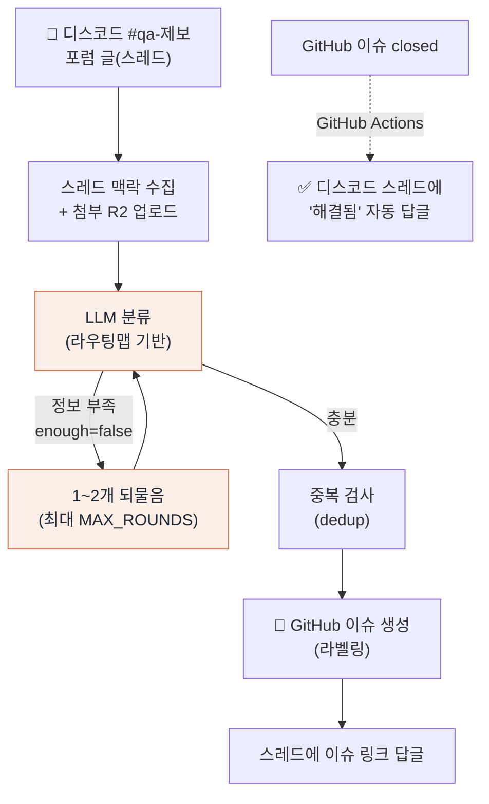

<div align="center">

# loen-qa-bot

**Discord QA 제보를 LLM으로 분류해 GitHub 이슈로 자동 적재하는 봇**
디스코드 `#qa-제보` 포럼 글 → 맥락 수집 → 분류 → 라벨링된 이슈 + 양방향 동기화


</div>

---

## 개요

Loen 운영 중 들어오는 QA 제보(디스코드 포럼 글)를 사람이 일일이 분류·이슈화하던 일을
자동화한 봇입니다. 제보 스레드의 맥락을 수집해 **LLM으로 영역·기능·심각도를 분류**하고,
중복을 검사한 뒤 **라벨이 달린 GitHub 이슈로 큐잉**합니다. 이슈가 닫히면 원본 디스코드
스레드에 해결 알림을 남기는 **양방향 동기화**까지 포함합니다.

> 이렇게 쌓인 이슈는 별도 triage → fix 파이프라인의 입력 큐가 됩니다.
> 전체 시스템 구조는 조직 프로필 → **[Logos Engineers](https://github.com/Logos-engineers)** 참고

## 동작 흐름



## 엔지니어링 하이라이트

- **🔁 프로바이더 교체형 LLM** — `QA_MODEL_PROVIDER` 환경변수만으로 Gemini(무료티어 테스트) ↔
  Anthropic Haiku(운영) 전환, **코드 불변**. 운영 모델엔 프롬프트 캐시 적용
- **🗣️ 대화형 상태 머신** — 분류에 정보가 부족하면(`enough=false`) 스레드에서 1~2회 되물어
  보강한 뒤 이슈화. 스레드별 상태는 `data/threads.json`에 **원자적(tmp→rename) 영속화**되어
  봇 재시작에도 진행 맥락 보존
- **⛓️ 스레드별 직렬 큐** — 같은 스레드의 메시지를 Promise 체인으로 직렬 처리해 race 방지
- **🔗 양방향 Discord ↔ GitHub 동기화** — 이슈 생성 시 스레드에 링크 답글, 이슈 closed 시
  GitHub Actions가 원본 스레드에 해결 알림 (이슈 본문의 출처 URL에서 스레드 ID 파싱)
- **🧭 구조화된 라우팅/라벨 체계** — 영역·기능·심각도 라벨을 일관 부여해 이후 triage 자동화의 입력으로 활용
- **♻️ 중복 방지** — 이슈 생성 전 dedup 검색으로 같은 제보의 중복 이슈 억제

## 셋업

1. `npm install`
2. `cp .env.example .env` 후 값 채우기:
   - `DISCORD_BOT_TOKEN` — discord.com/developers 봇 토큰
   - `QA_FORUM_CHANNEL_ID` — `#qa-제보` 포럼 채널 ID (개발자모드 → 우클릭 → ID 복사)
   - **분류 모델** — `QA_MODEL_PROVIDER=gemini`(기본, 무료티어 테스트) → `GEMINI_API_KEY` /
     `anthropic`(운영) → `ANTHROPIC_API_KEY`
   - `GITHUB_TOKEN` — fine-grained PAT, `Logos-engineers/loen-qa-bot`의 `Issues: write`
   - (첨부 업로드 시) Cloudflare R2 — `R2_ACCOUNT_ID`, `R2_ACCESS_KEY_ID`, `R2_SECRET_ACCESS_KEY`, `R2_BUCKET_NAME`
3. 로컬 실행: `npm run dev` / 운영: `pm2 start ecosystem.config.cjs`

## 분류 모델 전환

`.env`의 `QA_MODEL_PROVIDER`로 스위치 (코드 불변):

- `gemini` (기본): `GEMINI_MODEL=gemini-2.0-flash`, JSON 출력 강제(`responseMimeType`). 무료티어 테스트용
- `anthropic`: `HAIKU_MODEL=claude-haiku-4-5-20251001`, 프롬프트 캐시 적용. 운영 권장(설계 확정 모델)

## 디스코드 봇 권한

- 인텐트: **Message Content Intent** 켜기 (Developer Portal → Bot → Privileged Gateway Intents)
- 권한: Read Messages, Send Messages, Create Public Threads, Read Message History

## 프로젝트 구조

```
src/
  index.js        # 디스코드 리스너 + 스레드별 상태 머신/직렬 큐
  classify.js     # LLM 분류 (Gemini/Haiku, 프롬프트 캐시)
  routingMap.js   # 분류 기준(영역·기능·심각도 라우팅 맵)
  github.js       # dedup 검색 + 이슈 생성
  store.js        # 스레드 상태 JSON 영속화 (원자적 저장)
  storage.js      # 첨부 이미지 Cloudflare R2 업로드
  messages.js     # 디스코드 응답 메시지
  config.js       # env 로딩
scripts/          # e2e 테스트 · env/R2 점검 · 디스코드 알림 스크립트
.github/workflows/
  qa-close-notify.yml   # 이슈 closed → 디스코드 알림 (역방향)
```

## 라벨 체계

`qa-제보` · `area/{backend,frontend,obs-web,ai}` · `feat/{auth,home,note,obs,bible,oikos}` ·
`severity/P0~P3` · `needs-triage` · `needs-human`

## 이슈 닫힘 → 디스코드 알림 (역방향)

GitHub 이슈가 **closed** 되면 원본 디스코드 포럼 스레드에 "✅ 해결됨" 답글을 자동으로 남깁니다.

- 워크플로: `.github/workflows/qa-close-notify.yml` (`on: issues: closed`)
- 스크립트: `scripts/notify-discord-close.mjs` — 이슈 본문의
  `출처: …discord.com/channels/{guild}/{thread}/{msg}` 에서 스레드 ID를 파싱해 Discord REST API로 답글
- QA 봇이 만든 이슈(본문에 출처 URL 존재)만 대상. 그 외 이슈는 조용히 통과
- **필요 시크릿**: 레포 Settings → Secrets and variables → Actions 에 `DISCORD_BOT_TOKEN` 추가
  (봇 `.env`와 동일 값). 봇이 해당 포럼에 *스레드에서 메시지 보내기* 권한 보유해야 함

## 관련 저장소

- [loen-backend](https://github.com/Logos-engineers/loen-backend) — 메인 API 서버
- [loen-frontend](https://github.com/Logos-engineers/loen-frontend) — 모바일 앱 (제보 출처)
- [ai-server-loen](https://github.com/Logos-engineers/ai-server-loen) — AI 서비스

---

<div align="center">
<sub>← 전체 구조: <a href="https://github.com/Logos-engineers">Logos Engineers</a></sub>
</div>
